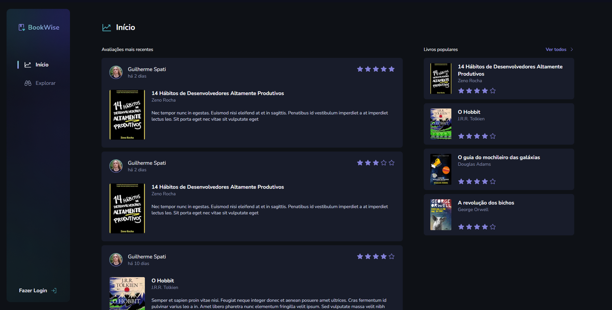
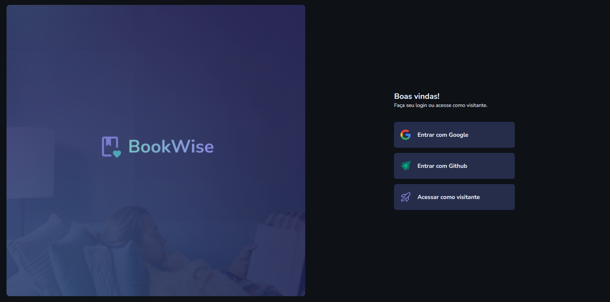
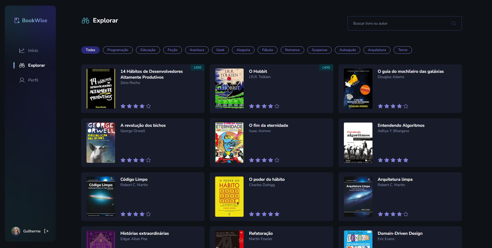
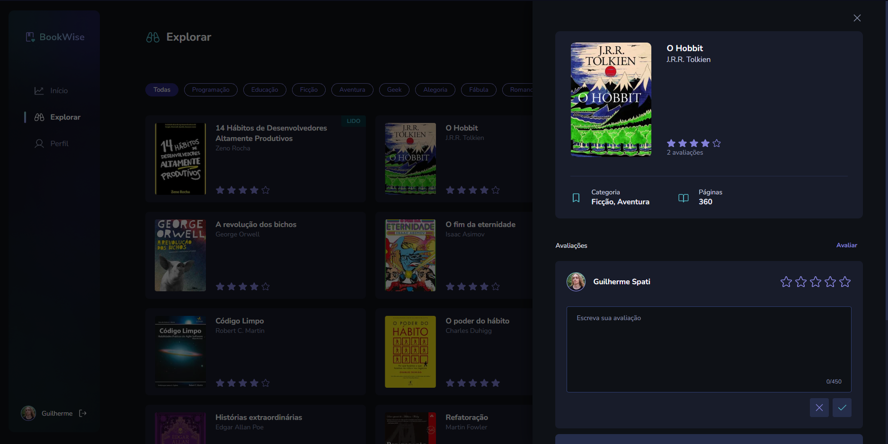
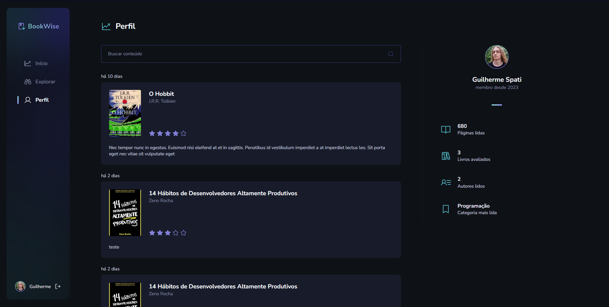

<h1 align="center">
    
</h1>

<span align="center">
    
</span>

O projeto Ignite Call é um espaço onde os usuários possam avaliar livros e ver as avaliações de outros usuários sobre diversas obras literárias. Também é possível pesquisar por livros, adicionar livros a uma lista de desejos e recomendar livros para outros usuários. O projeto foi desenvolvido utilizando [NextJS](https://nextjs.org/) utilizando integração de autenticação com o Google e GitHub.

## 🛠️ Construído com

Esse projeto foi desenvolvido com as seguintes tecnologias:

- [Next](https://nextjs.org/)
- [Next Auth](https://next-auth.js.org/)
- [ReactJS](https://reactjs.org)
- [TypeScript](https://www.typescriptlang.org/)
- [Stitches](https://stitches.dev/)
- [prisma](https://www.prisma.io/)

### 📋 Pré-requisitos

Para clonar e rodar essa aplicação, será necessário o [Git](https://git-scm.com) e o [Node.js](https://nodejs.org/en/) instalados no seu computador além de configurar um arquivo `.env` contendo as informações conforme o `.env.example`.

### 🔧 Como usar

```bash
# Clone este repositório
$ git clone https://github.com/guispati/BookWise.git

# Abra a pasta criada
$ cd BookWise

# Instale as dependências
$ npm install

# Inicie o projeto
$ npm run dev
```

## 💻 Demonstração

Na tela inicial você pode visualizar as avaliações mais recentes e também os livros mais populares.


Ao clicar no botão para fazer login, você poderá escolher realizar login com o Google, com o Github ou acessar como visitante, possibilitando visualizar as avaliações mais recentes, mas não podendo criar uma nova avaliação.


Na página explorar, você pode visualizar todos os livros cadastrados além de realizar buscas por nome do livro ou autor, ou filtrar livros por categorias:


Ao clicar na capa de um livro na página explorar, você pode visualizar informações sobre um livro, além de suas avaliações já feitas, e caso esteja logado, pode criar uma nova avaliação, informando a nota e uma descrição que ficará visível para outros usuários.


Você também pode visualizar o seu perfil, ou de outro usuário clicando na foto de qualquer usuário que tenha feito uma avaliação de um livro para visualizar informações como as avaliações feitas, e estatísticas de leitura daquele usuário.


## 📄 Licença

Este projeto está sob a licença MIT - veja o arquivo [LICENSE.md](LICENSE.md) para mais detalhes.

---
⌨️ com ❤️ por [Guilherme Spati](https://github.com/guispati) 😊